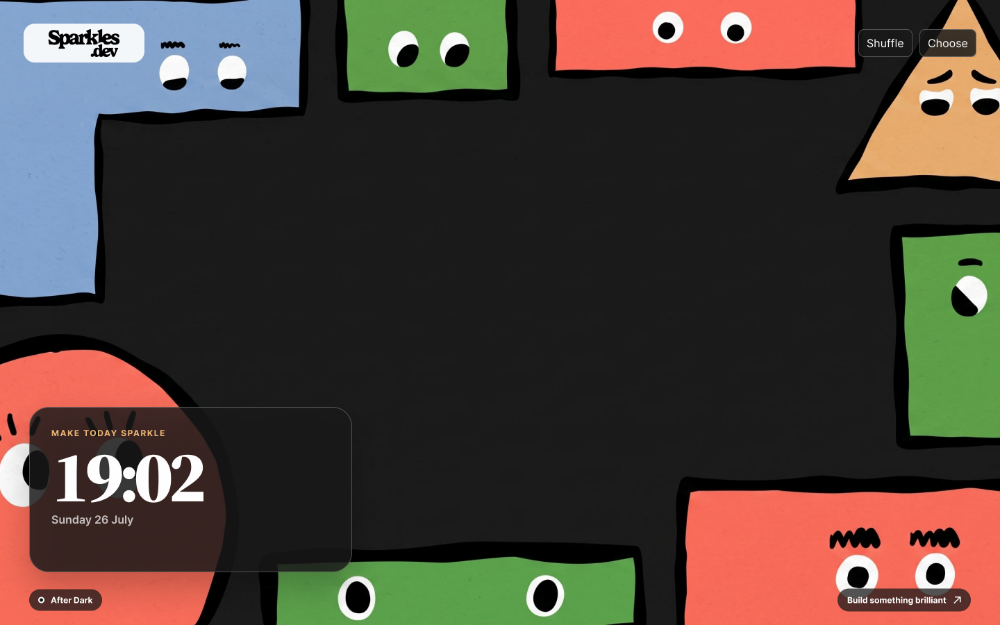

# Sparkles Wallpapers

A playful Chrome new-tab extension from [Sparkles.dev](https://sparkles.dev).
Every fresh tab opens on one of four original, brand-led wallpapers with a
clock, date, wallpaper picker, and a quick shuffle control.



## Features

- Four 2K, 16:9 wallpapers generated with the Higgsfield CLI.
- Random-on-every-tab mode or a fixed favorite.
- A focused new-tab clock and date.
- Keyboard shortcut: press `R` on a new tab to shuffle.
- Zero analytics, zero remote scripts, and only the `storage` permission.
- Direct links back to [sparkles.dev](https://sparkles.dev).

## Install in Chrome

1. Open `chrome://extensions`.
2. Turn on **Developer mode**.
3. Choose **Load unpacked**.
4. Select this repository folder.
5. Open a new tab.

## Development

The extension is deliberately build-free: edit the HTML, CSS, and JavaScript,
then press **Reload** on its card at `chrome://extensions`.

Run the checks with:

```sh
npm test
npm run validate
```

Create a clean Chrome Web Store package:

```sh
npm run package:webstore
```

Store listing copy and exact-dimension artwork live in [`store/`](store/).

## Wallpaper provenance

The four wallpapers were generated with the Higgsfield CLI using Nano Banana 2
at 2K resolution. The prompts referenced official Sparkles mascot art and used
the approved palette:

- Deep Black `#181818`
- Paper White `#FEFEFE`
- Golden Oat `#EBB676`
- Punchy Peach `#F8715F`
- Field Green `#54B16C`
- Daydream Sky `#87A8D5`

Official Sparkles logo artwork is used for the in-product brand lockup. The
generated wallpapers contain no generated logo or text.

## Privacy

See [PRIVACY.md](PRIVACY.md). In short: nothing leaves the device.

## License

Code is available under the [MIT License](LICENSE). Sparkles brand assets and
wallpaper artwork remain property of Sparkles.dev.
